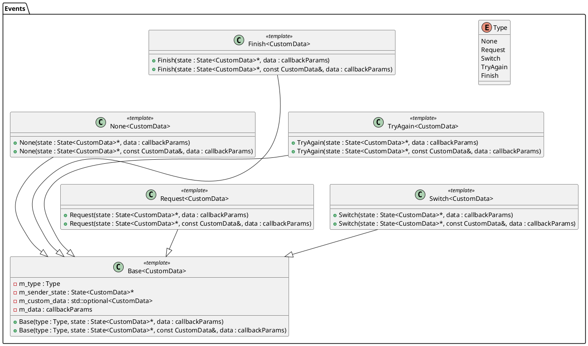

# Система состояний

Система позволяет задавать различные сценарии работы всей системы, в зависимости от определенных условий.

## Задачи

Нужно чтобы система могла взаимодействовать с Внешней средой. Чтобы кто-то мог закинуть какое-то событие внутрь и система сама решила чо делать. И чтобы система могла запросить ввод какой-то информации.


Общение будет произволиться так:
- От AuthService будет призодить сигнал в плагин, который будет в каком-то из методов делать `SM.update(data)`, что повлечет за собой обновление текущего состояния (обработка входящих данных)
- От Плагина после вызова `SM.update(data)` будет через `return Event`, который через интерфейс плагина будет уже отправлять какие-то данные *(InputRequest, ...)*

## Составляющие

**Пример диаграммы компонентов**

```plantuml
' left to right direction

[External Entity] as external

package "System: Scenario State Management" {

  [Scenario Manager] as scenario_mgr

    package "Scenarios" {
        component "Scenario 1" as scenario1
        component "Scenario N" as scenarioN
    }

    package "States" {
        [State A] as stateA
        [State B] as stateB
        [State C] as stateC
    }


  scenario_mgr --> scenario1 : update(data)
  scenario1 ..> scenario_mgr: return Event
  scenario_mgr --> scenarioN : update(data)
  scenarioN ..> scenario_mgr: return Event

  scenario1 --> stateA : update(data)
  stateA ..> scenario1 : return Event
  scenario1 --> stateB : update(data)
  stateB ..> scenario1 : return Event
  scenarioN --> stateC : update(data)
  stateC ..> scenarioN : return Event

  ' External interaction
  external --> scenario_mgr : update(data)
  scenario_mgr ..> external : return Event
}


note left of external
  Может быть клиентом, UI, или другой системой.
  Общается с менеджером сценариев через:
  update(data) и callback(data)
end note

note top of scenario_mgr
    Управляет множественными сценариями.
    Получает запросы от внешней сущности.
    Отправляет ответы внешней сущности.
end note

```


Система состоит из нескольких компонентов:
-  `Scanario Manager` - Управляющий сценариями. Может переключать сценарии, передавать запросы извне внутрь сценариев, отвечать сущностям. Реализует перключение между состояниями по такому отношению: `(Указатель на состояние, Результат выполнения) -> Указатель на новое состояние`
- `Scenarios` - Множество сценариев, которые описывают какуюто логику переключения состояний. Также позволяют передавать различные данные в состояния и из них.
- `States` - Множество состояний. Они могут выполнять какие-то действия внутри себя. 


> **Пример сценария исопльзования:** состояние `TryAgain` может запросить пароль у внешей сущности через `callback(data)` и, после получения ответа от внешней сущности через `update(data)`, обработать полученный пароль каким-либо образом.


### Система событий
Одной из составляющих является система состояний, которая включает в себя:

**Type** - Перечисление стандартных типов событий:
- `None` - Ничего не произошло. Больше именно для тестирования создавалось, хотя можно и к нему подвязаться.
- `Request` - Отправка запроса из текущего состояния во внешний объект, который триггернул работу текущего состояния.
- `Switch` - Запрос на переключение на другое состояние/сценарий (в зависимости от того, кто отправил этот запрос: состоение или сценарий).
- `TryAgain` - Запрос на перезапукс текущего состояния/сценария.
- `Finish` - Завершение цепочки состояний (весь сценарий пройден)

**Base** - Базовый класс события. Позволяет создать событие, которое будет обработано на уровень выше в иерархии (Если `return Event` был в состоянии, то обработка события будет в сценарии и т.д.)

**Классы унаследованные от Base** - классы, реализующие создаие события конкретного типа из `enum Type`.

Реализация обработки каждого события определяется в вышестоящих классах.

###

## Сценарии
### Обновление пароля

В этом сценарии будет следущющая диаграмма состояний:

```plantuml
' left to right direction

state "ReqestOldPassword" as ROP : Запрашивает старый пароль
state "CheckPassword" as CP : Проверяет пароль
state "RequestNewPassword" as RNP : Запрашивает новый пароль
state "RequestSavePassword" as RSP : Запрашивает сохранение пароля

[*] -> ROP
ROP ---> CP : Пароль пришел
ROP -> ROP : Пароля нет
CP ---> ROP : Неправильный пароль
CP --> RNP : Старый пароль правильный
RNP -> RNP: Пароля нет
RNP --> RSP : Новый пароль пришел
RSP -> [*]
```